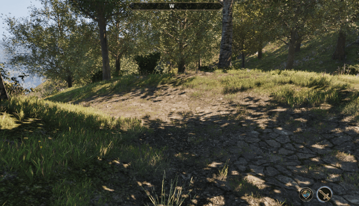

## Kwa Configs
[UE4SS](https://github.com/UE4SS-RE/RE-UE4SS) Config Panel mod for Oblivion Remastered

`ALT+C` to Open the panel

---

### Installation:

* Download release from the releases tab
* Extract the .zip to your game install directory ie : `C:\Program Files (x86)\Steam\steamapps\common\Oblivion Remastered`
* Ensure your `ue4ss\Mods\BPModLoaderMod` contains a blank `enabled.txt` file, or you've manually activated blueprint mods in UE4SS `"ue4ss\Mods\mods.txt"`

---

### Usage - Lua
* Install the mod as instructed above to your game directory
No development download required
*  **Refer to the** [example lua mod at: `KwaConfigPanelFiles/main.lua`](../KwaConfigPanelFiles/main.lua)

### Usage - Blueprint

* Install the mod as instructed above to your game directory
* Download development blueprints from the releases tab or clone the project
⚠️**DO NOT ADD THESE FILES TO YOUR PAK CHUNK, USE THEM AS DUMMY'S**⚠️
* If not cloning the project: Extract the zip to your projects content directory
* Get reference to main config panel widget with find all widgets of class: `WBP_KConfigPanel`
* Call `RegisterMod`
* Add Rows, Bind Events 
* Call `LoadParameters`

⚠️**I HIGHLY recommend exploring the example mod located at** `Content/Mods/ExampleMod_P` ⚠️

---

**Credits**
* **Kein UHT SDK Dump**  
↳ [github.com/Kein/Altar](https://github.com/Kein/Altar)  
* **UE4SS**  
↳ [github.com/UE4SS-RE/RE-UE4SS](https://github.com/UE4SS-RE/RE-UE4SS)  
