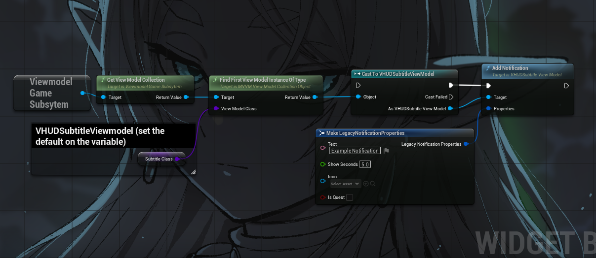
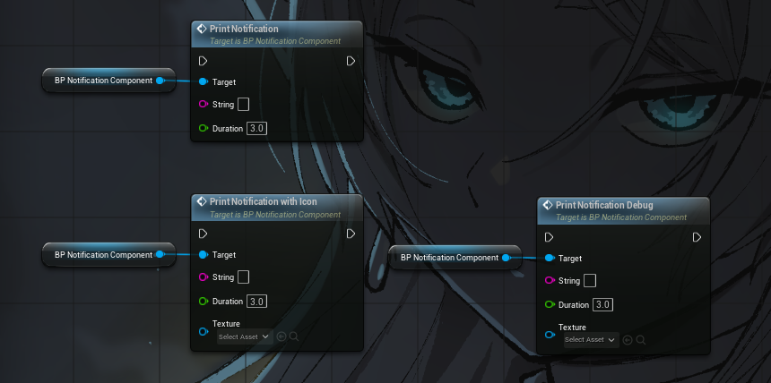
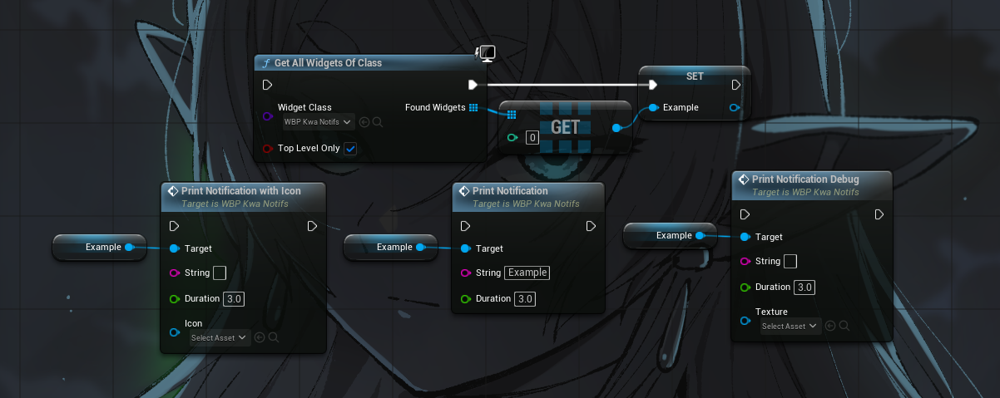
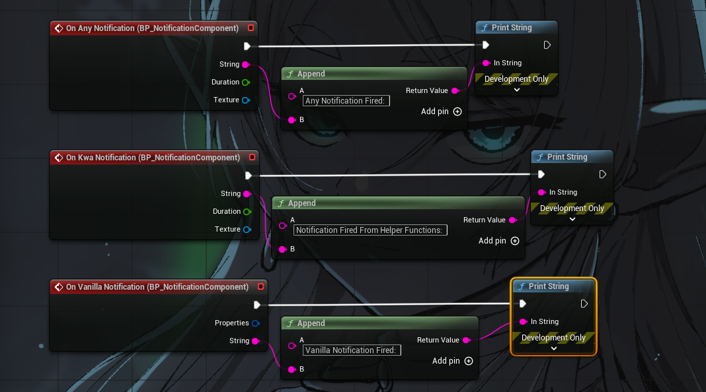

## Kwa Notifications System
UE4SS Oblivion Remastered notification mod

Compilation of this project does not require engine source

---

### Usage - Blueprint Via Vanilla Notification

No development download required
* Add a vanilla notification, it will get processed alongside them.


---

### Usage - Blueprint Via Dummy Integration

**YOU DO NOT NEED THE WHOLE PROJECT SOURCE TO ADD NOTIFICATIONS TO YOUR BLUEPRINT MOD, JUST IF YOU WANT TO MODIFY IT**

* Install the mod
* Download a development release from the releases tab
* Add the .uassets to your project's content folder **DO NOT ADD THESE FILES TO YOUR PAK CHUNK, USE THEM AS DUMMY'S**

#### Via Component:
* Add a `BP_NotificationComponent` to your actor (remember that `ModActor` is sometimes destructed so make sure you put the component on a living actor)
* Call functions on the component
* To turn on debug messages, click the component on the list, scroll down, and click the OnReady event, when the component is ready, you can call `SetDebugMessagesEnabled`



#### Via Reference to widget:
* Get all widgets of class `WBP_KwaNotifs` on a loop until the reference is valid and store it.
* Call functions on the reference


#### Via Global Notification
* Just call `PrintNotificationSlow`

---

### Usage - Lua
* Locate a reference to the WBP_KwaNotifs_C widget
* Call `KwaRef:PrintNotification("Example Notification", 3)`
(Message string, Duration)

#### Lua Example:
``` Lua
-- Find all KwaNotifs widgets
    local KwaNotifsRefs = FindObjects(0, "WBP_KwaNotifs_C", nil, 0, 0, true)
    if not KwaNotifsRefs or #KwaNotifsRefs == 0 then
        print("ERROR: Widget not found")
        return true
    end

    -- Select the instance with the transient path
    local KwaRef = nil
    for _, h in ipairs(KwaNotifsRefs) do
        if h:GetFullName():find("/Engine/Transient") then
            KwaRef = h
            break
        end
    end

    if not KwaRef or not KwaRef:IsValid() then
        print("ERROR: No valid transient widget found")
        return true
    end

    local success, err = pcall(function()
        KwaRef:PrintNotification("Example Notification", 3)
    end)
    
    print(success and "Success" or "ERROR: " .. tostring(err))
```

---

### Notification Component and WBP\_KwaNotifs

The core of the system is comprised of the `BP_NotificationComponent` and the `WBP_ModEntryPoint` widget blueprint. These classes provide the following functions for managing notifications:

* **PrintNotification**: Prints a standard notification message to the notification list.
* **PrintNotificationWithIcon**: Prints a notification message that can optionally include an icon. This function is safe to use even without providing an icon.
* **PrintNotificiationDebug**: Prints a notification message only when debug messages are explicitly enabled.
* **SetDebugMessagesEnabled**: Configures whether debug messages are enabled. This function should ideally be used in conjunction with the `OnReady` event to ensure the component is properly initialized.

---

### Events


Both `BP_NotificationComponent` and `WBP_ModEntryPoint` expose several bindable delegates to react to notification events:

* **OnKwaNotification**: Called specifically when a custom notification originating from this system is posted.
* **OnAnyNotification**: Called whenever any notification is posted, including both vanilla game notifications and custom notifications from this system.
* **OnVanillaNotification**: Called specifically when a notification originating from the base game is posted.


#### Component Only Event:

* **OnReady**: This event is unique to the `BP_NotificationComponent` and is called when a valid reference to the `WBP_KwaNotifs` widget is successfully located.

---

### BPFL\_KwaNotifications

The `BPFL_KwaNotifications` Global blueprint function for triggering notifications:

* **PrintNotificationSlow**: This function finds all available references to the `WBP_KwaNotifs` widget and invokes its print message function on each, broadcasting the notification, should be used sparingly due to global widget search.

---

**Credits**  
* **Kein Altar UHT SDK Dump**  
↳ [github.com/Kein/Altar](https://github.com/Kein/Altar)  
* **UE4SS**  
↳ [github.com/UE4SS-RE/RE-UE4SS](https://github.com/UE4SS-RE/RE-UE4SS)  

